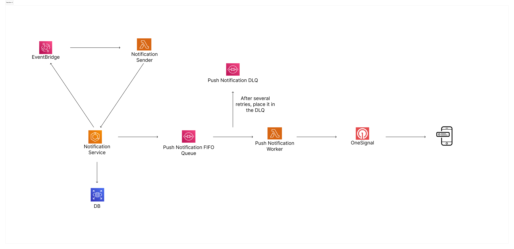

# Basic Notification Service

This backend service is designed to handle push notifications efficiently, leveraging modern technologies and AWS services to ensure scalability, reliability, and performance.

## Table of Contents

- [Overview](#overview)
- [Features](#features)
- [Architecture](#architecture)
- [Core Architectural Features](#core-architectural-features)
- [API Design](#api-design)
- [Database Models](#database-models)
- [Environment Variables](#environment-variables)

## Overview

The Notification Service is a robust backend application responsible for managing and dispatching push notifications to users. It integrates with various AWS services to handle message queuing, scheduling, and delivery, ensuring that notifications are sent reliably and efficiently.

# Notification System

A highly customizable and scalable notification system designed to deliver targeted, personalized messages efficiently.

## Features

- **Different Type Notifications**: Create and manage reusable notification templates. Send various types of notifications, ensuring flexibility for different use cases.
- **Scheduled Notifications**:
  - Automate notifications for specific user segments. For instance, schedule daily messages for non-premium US users at 22:00 or set one-time notifications for future events using AWS EventBridge.
  - Support for dynamic scheduling ensures timely delivery to the right audience.
- **Segmented Notifications**:
  - Notifications are tailored for predefined user segments (e.g., premium vs. non-premium users).
  - Leverages existing segmentation logic, avoiding duplication of segment tables. Batch jobs populate these segments for efficient targeting.
- **Personalized Notification Templates**:
  - Templates allow for dynamic data insertion, ensuring each notification is relevant to the recipient.
  - Simplified management of templates for easy creation, modification, and personalization.

## Architecture

The system architecture is built on **Node.js**, **TypeScript**, and **AWS services**, providing a robust foundation for high availability, fault tolerance, and extensibility.



## Core Architectural Features

- **Reliable Delivery with Retry Mechanism**:
  - Notifications automatically retry up to 3 times via AWS Lambda.
  - Messages failing after retries are routed to a Dead Letter Queue (DLQ) for debugging and analysis.
- **Duplicate Prevention**:
  - Using FIFO (First-In-First-Out) queues, the system ensures notifications are delivered only once to each recipient.
- **Extensibility**:
  - Designed with the Open/Closed Principle, allowing new notification types to be added without altering existing functionality.
  - Ideal for scaling as business needs evolve.
- **Template Flexibility**:
  - Templates are stored in a database, enabling seamless updates without code changes.
  - A UI layer can be integrated for user-friendly management of templates, including creation, editing, and previewing.
- **Monitoring and Observability**:
  - **CloudWatch Alarms**: Tracks errors in SQS and DLQ, triggering alerts to notify teams (e.g., via Slack) for immediate response.
  - **Amazon X-Ray**: Provides in-depth monitoring of ECS processes, identifying bottlenecks or failures during notification processing.

## API Design

### 1. **Create Schedule**

**POST** `/schedules`

Creates a new schedule for notifications.

#### Request Body

```json
{
  "name": "Daily Promo",
  "scheduleType": "cron" or "one-time",
  "templateId": "12345",
  "schedule": "0 22 * * ? *" or "2024-12-17T20:00",
  "segment": "non_premium_users",
  "timezone": "America/New_York"
}
```

### 2. **Send Bulk Notification**

**POST** `/push/send/bulk`

Sends bulk push notification to given segment

#### Request Body

```json
{
  "segment": "non_premium_us_users",
  "templateId": 1234
}
```

### 3. **Send Single Notification**

**POST** `/push/send`

Sends push notification to given user

#### Request Body

```json
{
  "userId": 12345,
  "templateId": 1234
}
```

## Database Models

### Users

- This table is created to complete the notification system, i have assumed more data already in prod table but for simplicity add several fields.
- **Purpose**: Store user information.
- **Key Columns**: `id`, `first_name`, `last_name`, `phone_number`.

### User Push Notifications

- This table is created to complete the notification system, i have assumed more data already in prod table but for simplicity add several fields.
- **Purpose**: Manage push notification details for each user.
- **Key Columns**: `id`, `user_id`, `push_token`, `one_signal_id`.

### Notifications

- **Purpose**: Record each notification sent to users.
- **Key Columns**: `id`, `user_id`, `template_id`, `type`, `status`.

### Notification Templates

- **Purpose**: Contain reusable templates for notifications.
- **Key Columns**: `id`, `key`, `lang`, `title`, `body`, `query_param`.

### Non Premium Users Segment Table

- This table is created to complete the notification system, i have assumed segment tables are being created within batch process and this notification system fetched only users from tables
- **Purpose**: Define user segments for targeted notifications.
- **Key Column**: `user_id`

## Environment Variables

### Server Environment Variables

Define these variables under the **server** folder:

```bash
# SQS Push Queue URL
PUSH_QUEUE_URL=

# Notify Sender Lambda ARN
SCHEDULER_TARGET_ARN=

# Notify Sender Lambda Role ARN
SCHEDULER_TARGET_ROLE_ARN=
```

### Infrastructure Environment Variables

Define these variables under the **infra** folder:

```bash
# One Signal Secret Manager Secret Arn
ONE_SIGNAL_SECRET_ARN=

# Docker image URL
IMAGE_URL=
```
